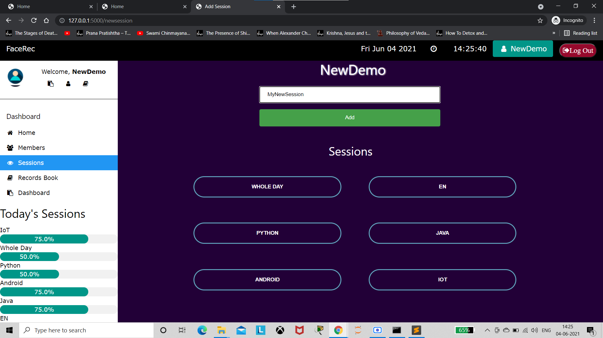
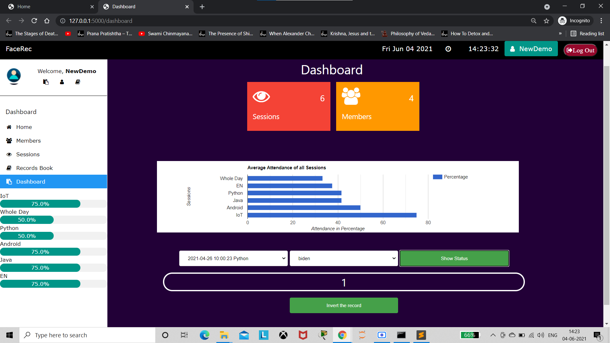
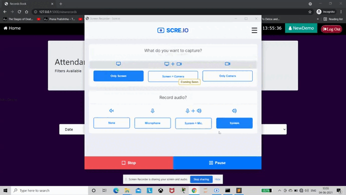

# Facial-Recognition-Attendance-Management-System Flask
## With provided Visual Analytics, Downloadable Records, Live Webcam Attendance

## Working

This Webapp allows organization to create account, upload the details of their members/employee/students, set up their sessions(for eg lectures, workshop, etc.) and take attendance session-wise. Admin will select a session, webacam will start and members will show their face one by one, when a members is recognized, his/her name will be displayed.
Attendance records can be viewd with filters, stats will be displayed with help of graphics, excel sheet of records can be downloaded.

## Installation:
Install [face_recognition](https://github.com/ageitgey/face_recognition) API

Refer [documentation](https://pypi.org/project/face-recognition/)

## Create database named rootdb with following query

CREATE DATABASE `rootdb`;

Create table roottable with following query

CREATE TABLE `roottable` (
  `id` int NOT NULL AUTO_INCREMENT,
  `accname` varchar(50) DEFAULT NULL,
  `accpassword` varchar(100) DEFAULT NULL,
  `accmail` varchar(50) DEFAULT NULL,
  `acccontact` mediumtext,
  PRIMARY KEY (`id`)
);

## Members

Adding a member is very intuitive.

## Session

Add sessions through which you'll take attendance. A default **Whole Day** Session will already exist.

## Dashboard

A **Dashboard** will show statistics about sessionwise attendance, it'll also allow you to alter a particular attendance record

## Member Records

Member's average attendance in each session and overall will be displayed along with his/her details. A list of all members with details is also displayed

## Attendance Records 

The Records can be viewed using filters - Date, Session, Member (with permutation & combination)

## Attendance

To take attendance, chose a session and show face in front of webcam, click stop when everyone is done

